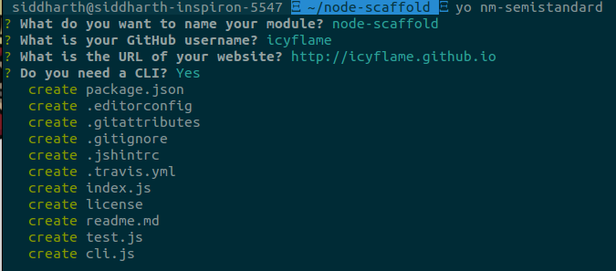

# generator-nm-semistandard [](https://travis-ci.org/icyflame/generator-nm-semistandard)

> Scaffold out a [node module](https://github.com/icyflame/node-module-boilerplate), following the [semistandard](https://github.com/Flet/semistandard) code style.

[](https://github.com/Flet/semistandard)

Based on [@sindresorhus/generator-nm](https://github.com/sindresorhus/generator-nm)

This is what I use for [my own modules](https://www.npmjs.com/~icyflame).




## Install

```
$ npm install --global generator-nm-semistandard
```


## Usage

With [yo](https://github.com/yeoman/yo):

```shell
$ yo nm-semistandard
# will run a generator, resulting in a module
# that follows the semistandard code style.
```

## Extensions over [generator-nm](https://github.com/sindresorhus/generator-nm) by [@sindresorhus](https://github.com/sindresorhus)

- **Semistandard added to the `devDependencies`**

- **`semistandard` is part of the `npm test` script.**

  Whenever `npm test` is run, code in the module is automatically checked for semistandard code style, and the test fails if there are any issues.

- **Add the Javascript semistandard code style badge to the README file**

 [](https://github.com/Flet/semistandard)

## License

MIT © [Siddharth Kannan](http://icyflame.github.io)
